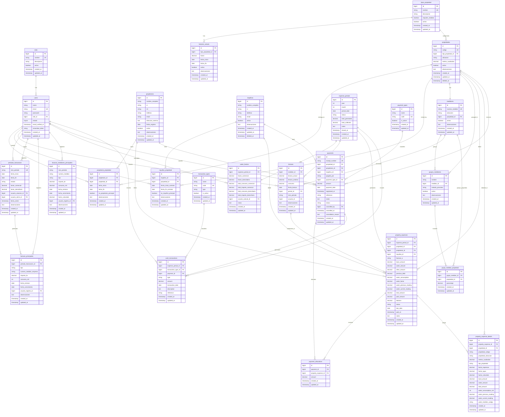

# Database Schema Diagram - Expensas 365Soft

```mermaid
erDiagram
    roles {
        bigint id PK
        string nombre UK
        string descripcion
        boolean activo
        timestamp created_at
        timestamp updated_at
    }

    users {
        bigint id PK
        string name
        string email UK
        string password
        bigint role_id FK
        tinyint estado
        timestamp email_verified_at
        string remember_token
        timestamp created_at
        timestamp updated_at
    }

    tipos_propiedad {
        bigint id PK
        string nombre UK
        string descripcion
        boolean requiere_medidor
        boolean activo
        timestamp created_at
        timestamp updated_at
    }

    factores_calculo {
        bigint id PK
        bigint tipo_propiedad_id FK
        decimal factor
        date fecha_inicio
        date fecha_fin
        boolean activo
        text observaciones
        timestamp created_at
        timestamp updated_at
    }

    propiedades {
        bigint id PK
        string codigo UK
        bigint tipo_propiedad_id FK
        string ubicacion
        decimal metros_cuadrados
        boolean activo
        text observaciones
        timestamp created_at
        timestamp updated_at
        timestamp deleted_at
    }

    propietarios {
        bigint id PK
        string nombre_completo
        string ci
        string nit
        string telefono
        string email
        text direccion_externa
        date fecha_registro
        boolean activo
        text observaciones
        timestamp created_at
        timestamp updated_at
    }

    inquilinos {
        bigint id PK
        string nombre_completo
        string ci
        string telefono
        string email
        boolean activo
        text observaciones
        timestamp created_at
        timestamp updated_at
        timestamp deleted_at
    }

    propietario_propiedad {
        bigint id PK
        bigint propietario_id FK
        bigint propiedad_id FK
        date fecha_inicio
        date fecha_fin
        boolean es_propietario_principal
        text observaciones
        timestamp created_at
        timestamp updated_at
    }

    inquilino_propiedad {
        bigint id PK
        bigint inquilino_id FK
        bigint propiedad_id FK
        date fecha_inicio_contrato
        date fecha_fin_contrato
        boolean es_inquilino_principal
        text observaciones
        timestamp created_at
        timestamp updated_at
    }

    medidores {
        bigint id PK
        string numero_medidor UK
        string ubicacion
        bigint propiedad_id FK
        boolean activo
        text observaciones
        timestamp created_at
        timestamp updated_at
    }

    grupos_medidores {
        bigint id PK
        string nombre
        bigint medidor_id FK
        string metodo_prorrateo
        boolean activo
        text observaciones
        timestamp created_at
        timestamp updated_at
    }

    grupo_medidor_propiedad {
        bigint id PK
        bigint grupo_medidor_id FK
        bigint propiedad_id FK
        decimal porcentaje
        timestamp created_at
        timestamp updated_at
    }

    lecturas {
        bigint id PK
        bigint medidor_id FK
        decimal lectura_actual
        decimal lectura_anterior
        decimal consumo
        date fecha_lectura
        bigint period_id FK
        string mes_periodo
        bigint usuario_id FK
        text observaciones
        timestamp created_at
        timestamp updated_at
    }

    expense_periods {
        bigint id PK
        int year
        int month
        date period_date
        string status
        decimal total_generated
        decimal total_collected
        text notes
        timestamp closed_at
        timestamp created_at
        timestamp updated_at
    }

    periodos_facturacion {
        bigint id PK
        string mes_periodo UK
        date fecha_inicio
        date fecha_fin
        string estado
        decimal factor_comercial
        decimal factor_domiciliario
        bigint usuario_creacion_id FK
        bigint usuario_cierre_id FK
        timestamp fecha_cierre
        text observaciones
        timestamp created_at
        timestamp updated_at
    }

    water_factors {
        bigint id PK
        bigint expense_period_id FK
        decimal factor_comercial
        decimal factor_domiciliario
        decimal total_consumo_comercial
        decimal total_importe_comercial
        decimal total_consumo_domiciliario
        decimal total_importe_domiciliario
        bigint usuario_calculo_id FK
        text notas
        timestamp created_at
        timestamp updated_at
    }

    facturas_principales {
        bigint id PK
        bigint periodo_facturacion_id FK
        string tipo
        string numero_medidor_empresa
        decimal importe_bs
        int consumo_m3
        date fecha_emision
        date fecha_vencimiento
        bigint usuario_registro_id FK
        text observaciones
        timestamp created_at
        timestamp updated_at
    }

    facturas_medidores_principales {
        bigint id PK
        string mes_periodo
        string numero_medidor
        string tipo
        decimal importe_bs
        decimal consumo_m3
        date fecha_emision
        date fecha_vencimiento
        decimal factor_calculado
        bigint usuario_registro_id FK
        text observaciones
        timestamp created_at
        timestamp updated_at
    }

    property_expenses {
        bigint id PK
        bigint expense_period_id FK
        bigint propiedad_id FK
        bigint propietario_id FK
        bigint inquilino_id FK
        string facturar_a
        decimal base_amount
        decimal water_amount
        decimal other_amount
        decimal previous_debt
        decimal water_consumption
        decimal water_factor
        decimal water_previous_reading
        decimal water_current_reading
        decimal total_amount
        decimal paid_amount
        decimal balance
        string status
        date due_date
        timestamp paid_at
        text notes
        timestamp created_at
        timestamp updated_at
    }

    property_expense_details {
        bigint id PK
        bigint property_expense_id FK
        bigint propiedad_id FK
        string propiedad_codigo
        string propiedad_ubicacion
        decimal metros_cuadrados
        string tipo_propiedad
        decimal factor_expensas
        decimal factor_agua
        decimal factor_calculado
        decimal base_amount
        decimal water_amount
        decimal total_amount
        int water_consumption_m3
        decimal water_previous_reading
        decimal water_current_reading
        string water_medidor_codigo
        timestamp created_at
        timestamp updated_at
    }

    payment_types {
        bigint id PK
        string name
        string code UK
        boolean is_active
        timestamp created_at
        timestamp updated_at
    }

    transaction_types {
        bigint id PK
        string name
        string code UK
        string type
        boolean is_active
        timestamp created_at
        timestamp updated_at
    }

    payments {
        bigint id PK
        string receipt_number UK
        bigint propiedad_id FK
        bigint propietario_id FK
        bigint inquilino_id FK
        string pagado_por
        bigint payment_type_id FK
        decimal amount
        date payment_date
        timestamp registered_at
        string reference
        text notes
        string status
        bigint cancelled_by FK
        timestamp cancelled_at
        text cancellation_reason
        timestamp created_at
        timestamp updated_at
    }

    payment_allocations {
        bigint id PK
        bigint payment_id FK
        bigint property_expense_id FK
        decimal amount
        timestamp created_at
        timestamp updated_at
    }

    cash_transactions {
        bigint id PK
        bigint expense_period_id FK
        bigint transaction_type_id FK
        bigint payment_id FK
        string type
        decimal amount
        date transaction_date
        text description
        string reference
        timestamp created_at
        timestamp updated_at
    }

    roles ||--o{ users : "has"
    users ||--o{ propietario_propiedad : "registers"
    users ||--o{ inquilino_propiedad : "registers"
    users ||--o{ lecturas : "records"
    users ||--o{ periodos_facturacion : "creates"
    users ||--o{ periodos_facturacion : "closes"
    users ||--o{ facturas_principales : "registers"
    users ||--o{ facturas_medidores_principales : "registers"
    users ||--o{ water_factors : "calculates"
    users ||--o{ payments : "cancels"
    users ||--o{ cash_transactions : "records"

    tipos_propiedad ||--o{ factores_calculo : "has"
    tipos_propiedad ||--o{ propiedades : "categorizes"

    propiedades ||--o{ propietario_propiedad : "belongs_to"
    propiedades ||--o{ inquilino_propiedad : "rented_by"
    propiedades ||--|| medidores : "has"
    propiedades ||--o{ grupos_medidores : "grouped_in"
    propiedades ||--o{ property_expenses : "billed"
    propiedades ||--o{ property_expense_details : "detailed_in"
    propiedades ||--o{ payments : "receives"

    propietarios ||--o{ propietario_propiedad : "owns"
    propietarios ||--o{ property_expenses : "billed"
    propietarios ||--o{ payments : "pays"

    inquilinos ||--o{ inquilino_propiedad : "rents"
    inquilinos ||--o{ property_expenses : "billed"
    inquilinos ||--o{ payments : "pays"

    medidores ||--o{ grupos_medidores : "groups"
    medidores ||--o{ lecturas : "measured"
    medidores ||--o{ grupo_medidor_propiedad : "groups_properties"

    grupos_medidores ||--o{ grupo_medidor_propiedad : "includes"

    lecturas ||--o{ property_expenses : "contributes_to"

    expense_periods ||--|| water_factors : "has"
    expense_periods ||--o{ lecturas : "covers"
    expense_periods ||--o{ property_expenses : "generates"
    expense_periods ||--o{ cash_transactions : "records"

    periodos_facturacion ||--o{ facturas_principales : "generates"

    payment_types ||--o{ payments : "classifies"

    transaction_types ||--o{ cash_transactions : "classifies"

    payments ||--o{ payment_allocations : "allocates"
    payments ||--o{ cash_transactions : "generates"

    property_expenses ||--o{ payment_allocations : "receives"
    property_expenses ||--o{ property_expense_details : "details"
```