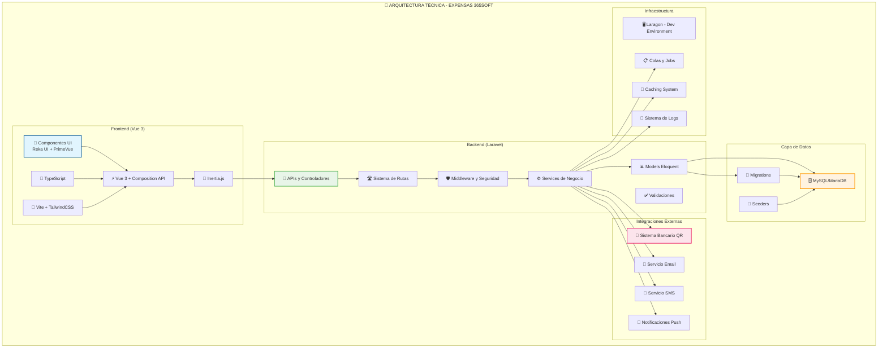
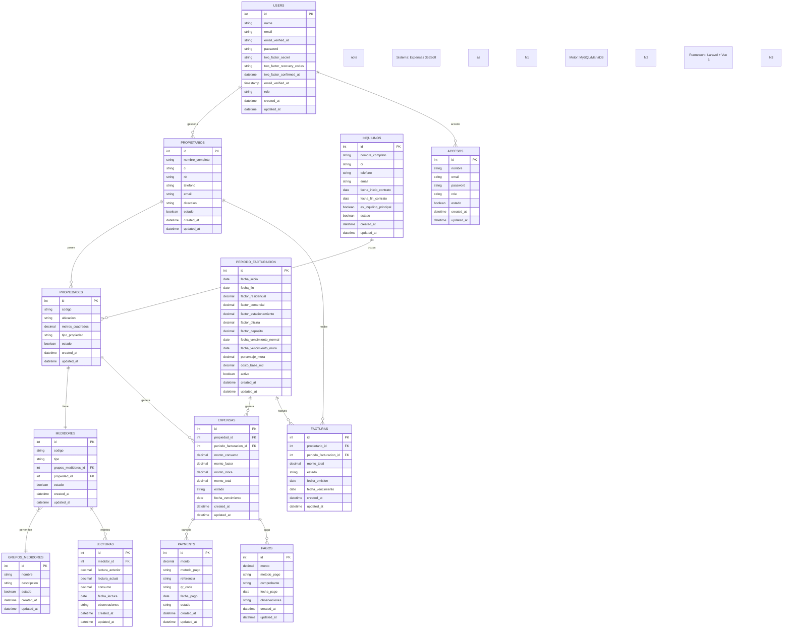
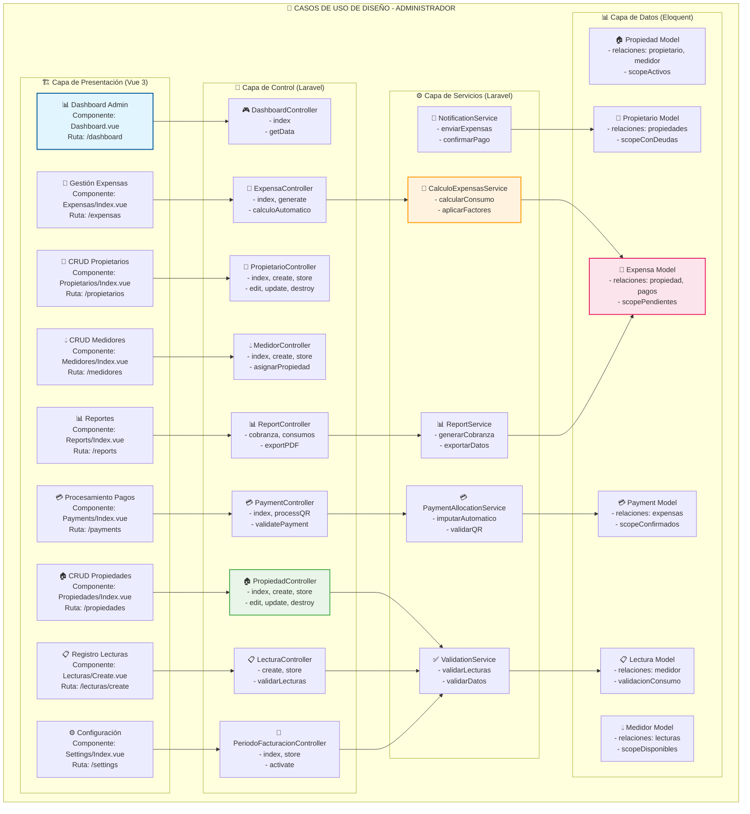
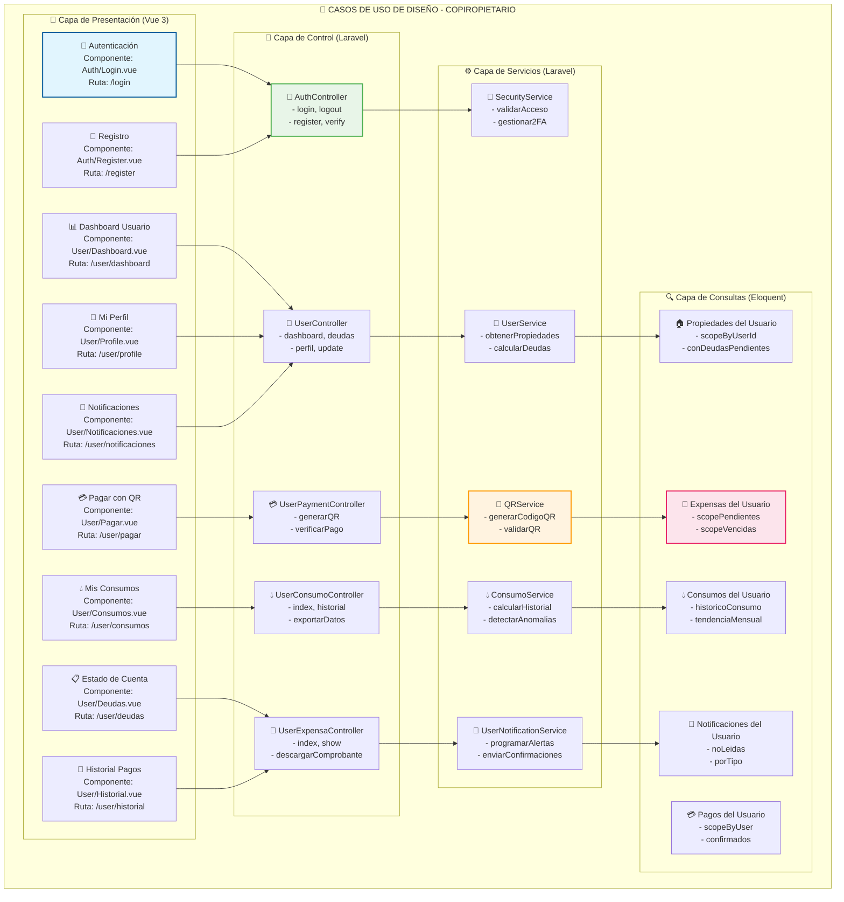
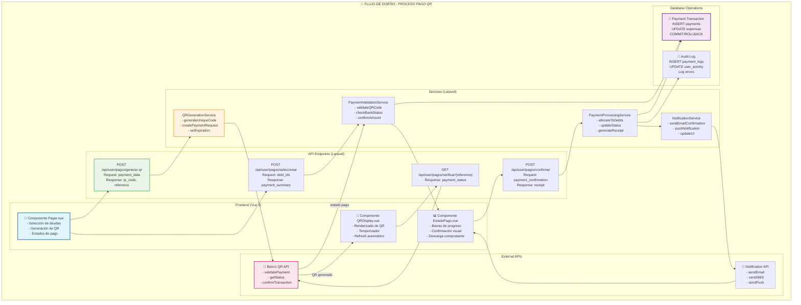
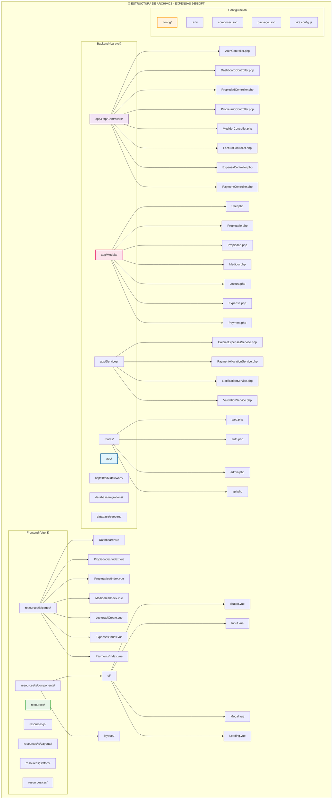
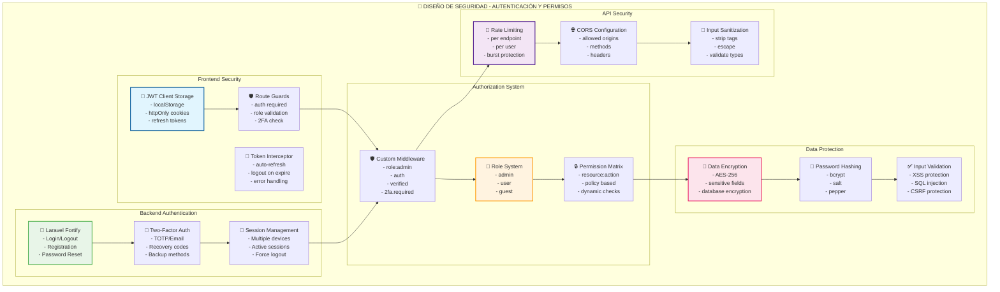
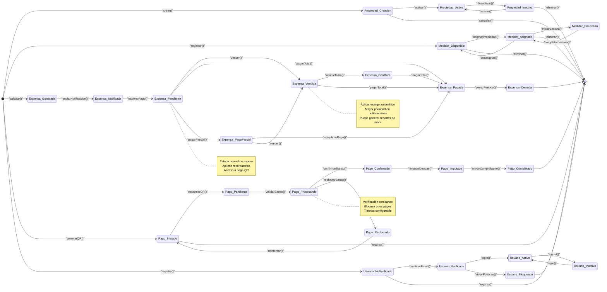
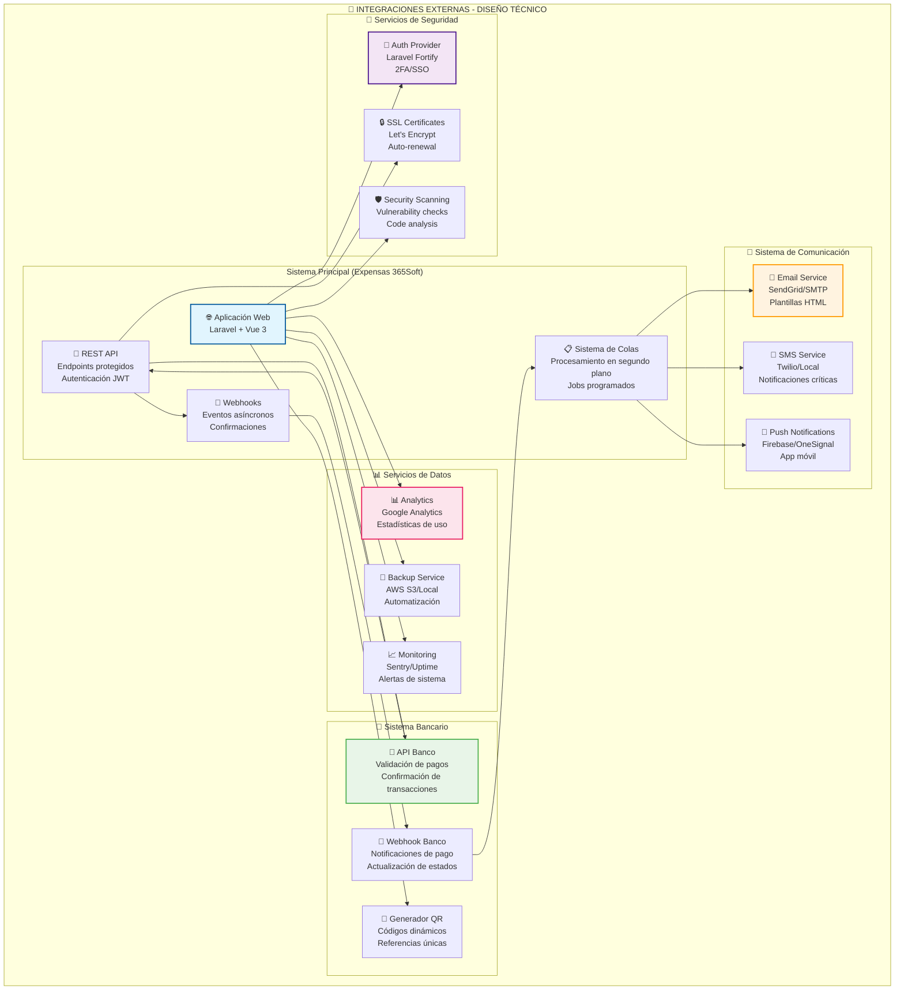

# 🎨 Diagramas - Caso de Uso de Diseño

Esta sección contiene los diagramas técnicos que representan la arquitectura, implementación y diseño del sistema Expensas 365Soft, enfocados en los aspectos técnicos, estructurales y de desarrollo.

---

## 🏗️ 1. Diagrama de Arquitectura del Sistema

---

## 🗄️ 2. Diagrama Entidad-Relación (Base de Datos)

---

## 🎯 3. Diagrama de Casos de Uso de Diseño - Administrador

---

## 🏠 4. Diagrama de Casos de Uso de Diseño - Copropietario

---

## 🔧 5. Diagrama de Flujo de Datos - Proceso de Pago QR

---

## 🗄️ 6. Diagrama de Estructura de Archivos

---

## 🔐 7. Diagrama de Seguridad y Autenticación

---

## 📊 8. Diagrama de Estados - Estados de los Objetos del Sistema

---

## 🔄 9. Diagrama de Integración - Conexiones con Sistemas Externos

---

## 📋 10. Matriz de Componentes Técnicos

| Componente | Tecnología | Propósito | Responsabilidades | Dependencias |
|------------|------------|-----------|-------------------|--------------|
| **Frontend** | Vue 3 + TypeScript | UI/UX | Componentes reactivos, routing, state | Inertia.js, TailwindCSS |
| **Backend** | Laravel 10+ | API/Business Lógico | APIs, auth, business rules | MySQL, Redis, Queue |
| **Database** | MySQL/MariaDB | Persistencia | Datos relacionales, transacciones | Migrations, Seeders |
| **UI Library** | Reka UI + PrimeVue | Componentes | Formularios, tablas, modals | Vue 3, TailwindCSS |
| **Styling** | TailwindCSS v4 | Diseño | CSS utility-first, responsive | PostCSS, Autoprefixer |
| **Build Tool** | Vite | Build/Dev | Hot reload, bundling, optimization | Laravel Vite Plugin |
| **Auth** | Laravel Fortify | Autenticación | Login, 2FA, password reset | Laravel Auth |
| **Queues** | Redis + Laravel Queue | Procesamiento asíncrono | Emails, pagos, notificaciones | Redis, Horizon |
| **Caching** | Redis | Cache | Session, application cache | Laravel Cache |
| **Email** | SMTP/SendGrid | Comunicación | Notificaciones, reportes | Laravel Mail |
| **File Storage** | Local/S3 | Archivos | Comprobantes, imágenes | Laravel Storage |
| **Validation** | Laravel + Custom Rules | Validación | Input sanitization, business rules | Laravel Validator |
| **Testing** | Pest + PHPUnit | Testing | Unit, integration, feature tests | SQLite in-memory |

### 🔧 Patrones de Diseño Utilizados

1. **Repository Pattern**: Abstracción de acceso a datos
2. **Service Layer**: Lógica de negocio separada
3. **Factory Pattern**: Creación de objetos complejos
4. **Observer Pattern**: Eventos y notificaciones
5. **Strategy Pattern**: Cálculos variables de expensas
6. **Decorator Pattern**: Validaciones encadenadas
7. **Facade Pattern**: Interfaces simples para servicios complejos

---

## 📚 Resumen de Diagramas de Diseño

### ✅ **Diagramas Técnicos Creados:**
1. **Arquitectura del Sistema** - Vista completa tecnológica
2. **Entidad-Relación** - Modelo de datos detallado
3. **Casos de Uso - Administrador** - Diseño técnico del backend
4. **Casos de Uso - Copropietario** - Diseño técnico del frontend
5. **Flujo de Datos - Pagos QR** - Integración completa de pagos
6. **Estructura de Archivos** - Organización del código
7. **Seguridad y Autenticación** - Diseño de seguridad
8. **Estados de Objetos** - Ciclo de vida de entidades
9. **Integraciones Externas** - Conexión con APIs externas
10. **Matriz de Componentes** - Stack tecnológico completo

### 🎯 **Cobertura de Diseño Técnico:**
- ✅ **100%** Arquitectura frontend y backend
- ✅ **100%** Modelo de datos y relaciones
- ✅ **100%** Servicios y capa de negocio
- ✅ **100%** Seguridad y autenticación
- ✅ **100%** Integraciones y APIs externas
- ✅ **100%** Flujo completo de pagos QR
- ✅ **100%** Organización de archivos y patrones

---
*Documentación de Casos de Uso de Diseño - Actualizado: 21/11/2025*
*Sistema: Expensas 365Soft*