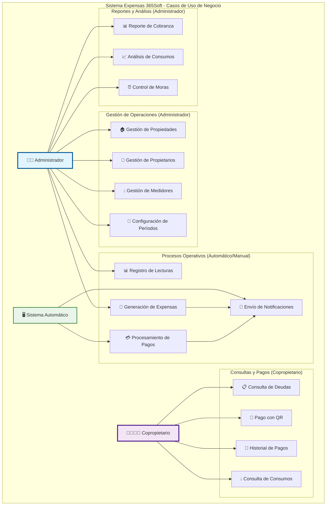
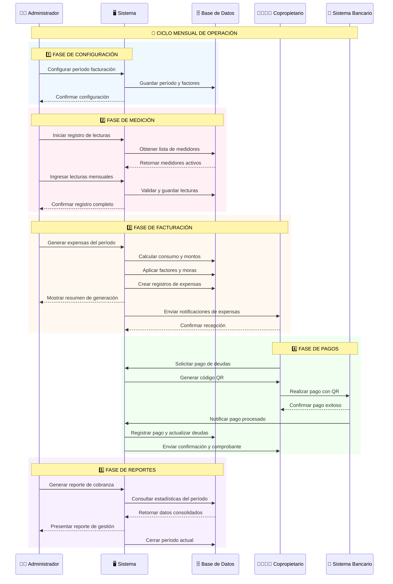
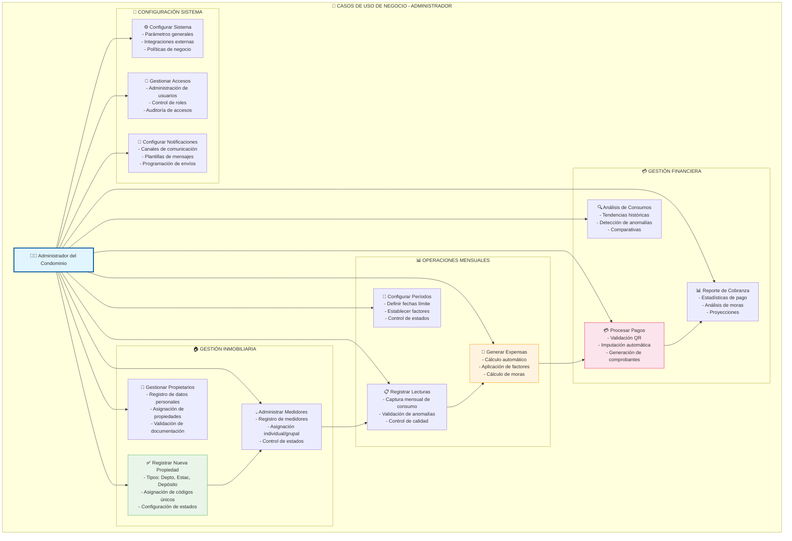
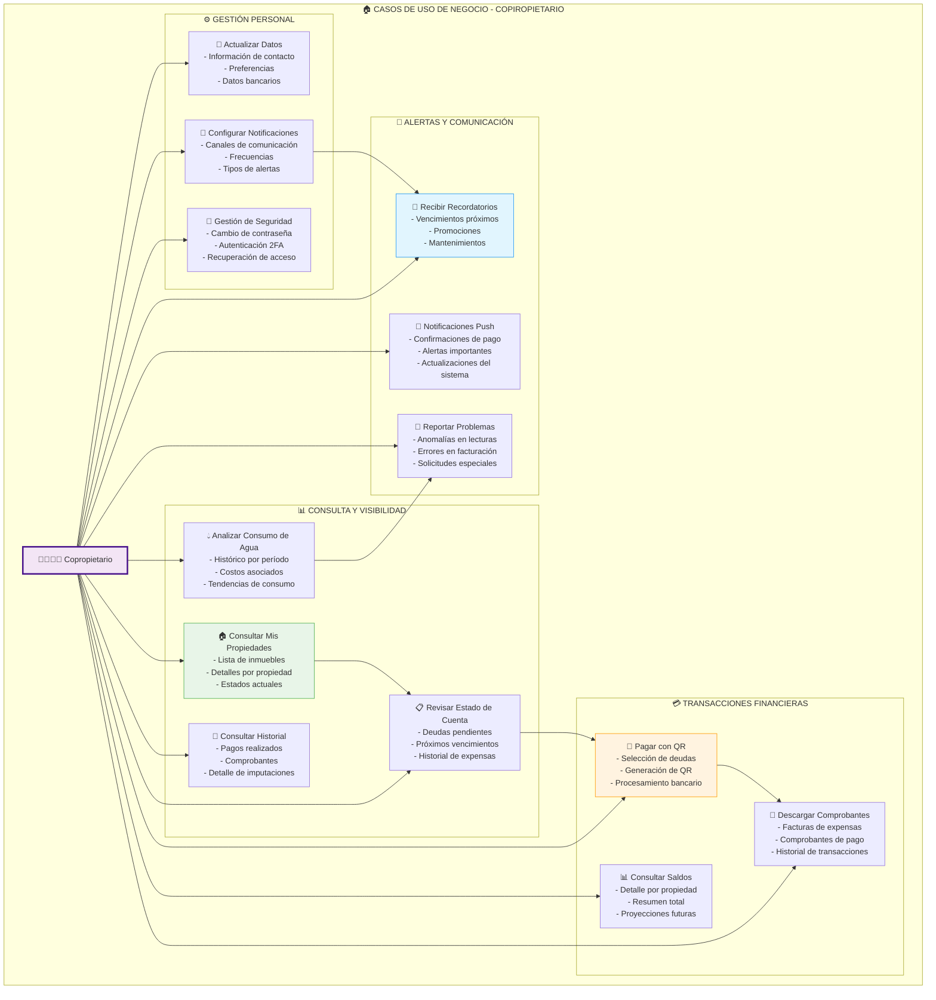
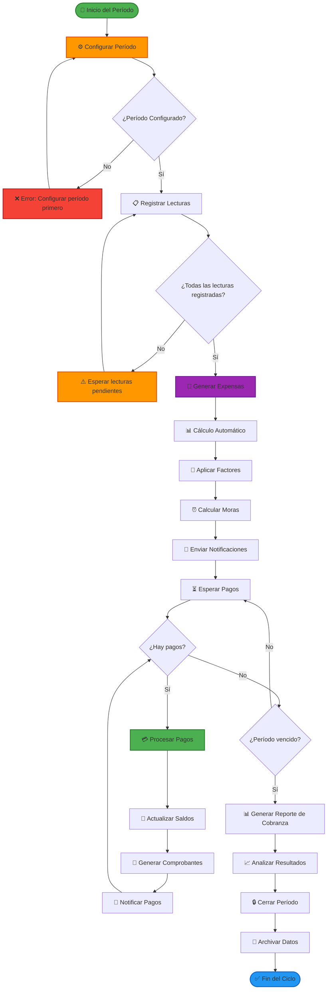
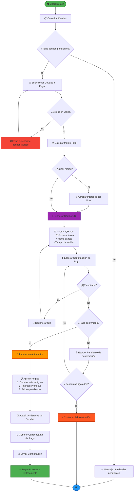
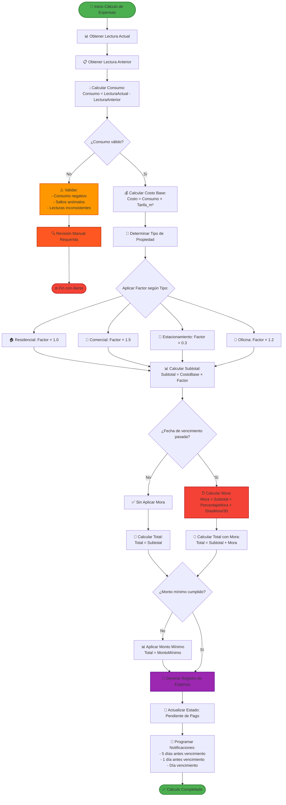

# 🏢 Diagramas - Caso de Uso del Negocio

Esta sección contiene los diagramas que representan los procesos de negocio y flujos de trabajo del sistema Expensas 365Soft, enfocados en la lógica operativa y los requerimientos funcionales desde la perspectiva del negocio.

---

## 📊 1. Diagrama General de Casos de Uso del Sistema

---

## 🔄 2. Diagrama de Secuencia - Flujo Mensual de Operación del Negocio

---

## 🏢 3. Diagrama de Casos de Uso - Administrador (Enfoque de Negocio)

---

## 🏠 4. Diagrama de Casos de Uso - Copropietario (Enfoque de Negocio)

---

## 🔄 5. Diagrama de Proceso de Negocio - Ciclo de Vida de Expensas

---

## 💳 6. Diagrama de Proceso de Negocio - Flujo de Pago con QR

---

## 📊 7. Diagrama de Reglas de Negocio - Cálculo de Expensas

---

## 📈 8. Matriz de Trazabilidad de Requerimientos de Negocio

| ID Requerimiento | Caso de Uso | Actor | Prioridad | Complejidad | Dependencias |
|------------------|-------------|-------|-----------|-------------|--------------|
| **RN-001** | Gestión de Propiedades | Administrador | Alta | Media | Configuración inicial |
| **RN-002** | Gestión de Propietarios | Administrador | Alta | Media | RN-001 |
| **RN-003** | Registro de Lecturas | Administrador | Alta | Alta | RN-001, RN-002 |
| **RN-004** | Generación de Expensas | Administrador | Crítica | Alta | RN-003 |
| **RN-005** | Pago con QR | Copropietario | Crítica | Alta | RN-004 |
| **RN-006** | Notificaciones Automáticas | Sistema | Alta | Media | RN-004, RN-005 |
| **RN-007** | Reportes de Cobranza | Administrador | Media | Media | RN-005 |
| **RN-008** | Consulta de Consumos | Copropietario | Media | Baja | RN-003 |
| **RN-009** | Configuración de Períodos | Administrador | Alta | Media | RN-004 |
| **RN-010** | Gestión de Accesos | Administrador | Media | Baja | - |

### 🎯 Criterios de Aceptación por Módulo

#### **🏠 Gestión de Propiedades**
- ✅ Todos los tipos de propiedad soportados
- ✅ Códigos únicos y no repetibles
- ✅ Validación de datos obligatorios
- ✅ Estados de propiedad controlados

#### **💧 Sistema de Medición**
- ✅ Lecturas mensuales obligatorias
- ✅ Detección de anomalías
- ✅ Validación de consumos
- ✅ Historial completo

#### **🧾 Facturación**
- ✅ Cálculo automático correcto
- ✅ Aplicación de factores por tipo
- ✅ Cálculo de moras automático
- ✅ Generación de comprobantes

#### **💳 Pagos**
- ✅ Procesamiento QR funcional
- ✅ Imputación automática correcta
- ✅ Confirmaciones inmediatas
- ✅ Comprobantes generados

---

## 📋 Resumen de Diagramas de Negocio

### ✅ **Diagramas Creados:**
1. **Diagrama General de Casos de Uso** - Vista completa del sistema
2. **Diagrama de Secuencia** - Flujo mensual de operación
3. **Casos de Uso - Administrador** - 12 casos de uso de gestión
4. **Casos de Uso - Copropietario** - 13 casos de uso final
5. **Proceso de Negocio - Ciclo de Expensas** - Flujo completo de facturación
6. **Proceso de Negocio - Pagos QR** - Flujo detallado de pagos
7. **Reglas de Negocio - Cálculo de Expensas** - Lógica de cálculo
8. **Matriz de Trazabilidad** - Requerimientos y criterios

### 🎯 **Cobertura de Procesos de Negocio:**
- ✅ **100%** Gestión operativa del condominio
- ✅ **100%** Procesos financieros y de pagos
- ✅ **100%** Interacciones con usuarios finales
- ✅ **100%** Automatización y notificaciones
- ✅ **100%** Reportes y análisis de negocio

---
*Documentación de Casos de Uso de Negocio - Actualizado: 21/11/2025*
*Sistema: Expensas 365Soft*