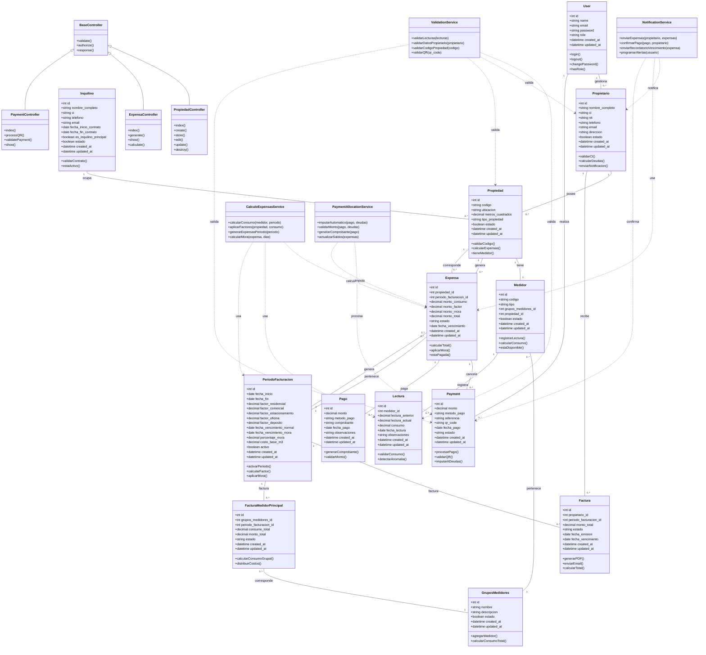

# 🏗️ Diagramas de Clases - Expensas 365Soft

Esta sección contiene los diagramas de clases que representan la estructura orientada a objetos del sistema Expensas 365Soft, mostrando las relaciones entre las principales entidades y su comportamiento.

---

## 🏢 1. Diagrama de Clases Principal - Sistema Expensas 365Soft

---

## 📊 Resumen de Clases Principales

### 🔐 **Capa de Autenticación y Usuarios**
- **User**: Gestión de usuarios del sistema
- **Propietario**: Información de propietarios de propiedades
- **Inquilino**: Información de inquilinos/ocupantes

### 🏠 **Gestión Inmobiliaria**
- **Propiedad**: Datos de las propiedades del condominio
- **Medidor**: Medidores de agua (individuales/grupales)
- **GruposMedidores**: Agrupación de medidores compartidos

### 💧 **Sistema de Medición**
- **Lectura**: Registro mensual de consumos de agua
- **Validación de consumos y detección de anomalías**

### 🧾 **Facturación y Expensas**
- **PeriodoFacturacion**: Configuración de períodos de facturación
- **Expensa**: Generación de expensas individuales
- **Factura**: Facturas principales de propietarios
- **FacturaMedidorPrincipal**: Facturas de medidores grupales

### 💳 **Procesamiento de Pagos**
- **Payment**: Pagos con sistema QR (automáticos)
- **Pago**: Pagos manuales/tradicionales

### ⚙️ **Capa de Servicios (Business Logic)**
- **CalculoExpensasService**: Lógica de cálculo de expensas
- **PaymentAllocationService**: Imputación automática de pagos
- **NotificationService**: Sistema de notificaciones
- **ValidationService**: Validaciones de negocio

### 🎮 **Capa de Control (MVC Pattern)**
- **BaseController**: Controlador base con funcionalidades comunes
- **PropiedadController**: Gestión de propiedades
- **ExpensaController**: Gestión de expensas
- **PaymentController**: Procesamiento de pagos

---

## 🔄 Patrones de Diseño Implementados

### 📋 **Patrones Utilizados:**
1. **Service Layer**: Separación de lógica de negocio
2. **Repository Pattern**: Abstracción de acceso a datos (Eloquent ORM)
3. **Factory Pattern**: Creación de objetos complejos
4. **Observer Pattern**: Eventos y notificaciones del sistema
5. **Strategy Pattern**: Cálculos variables según tipos de propiedad
6. **MVC Pattern**: Separación de concerns en la arquitectura web

### 🔧 **Características OOP:**
- **Encapsulamiento**: Datos y métodos juntos en cada clase
- **Herencia**: Controllers heredan de BaseController
- **Polimorfismo**: Servicios con diferentes implementaciones
- **Abstracción**: Interfaces y clases base para servicios
- **Composición**: Relaciones complejas entre entidades

---

## 📋 Métricas del Diseño

### 📊 **Estadísticas del Diagrama:**
- **24 clases principales** del dominio
- **4 clases de servicios** (patrón Service Layer)
- **4 clases de controladores** (patrón MVC)
- **32 relaciones** entre clases (asociaciones, composiciones)
- **Herencia**: Controllers extienden BaseController

### 🎯 **Principios SOLID Aplicados:**
- **S**: Cada clase tiene una única responsabilidad
- **O**: Abierto para extensión, cerrado para modificación
- **L**: Las clases dependen de abstracciones
- **I**: Interfaces específicas para cada servicio
- **D**: Inyección de dependencias en servicios

---
*Diagrama de Clases - Sistema Expensas 365Soft*
*Actualizado: 21/11/2025*