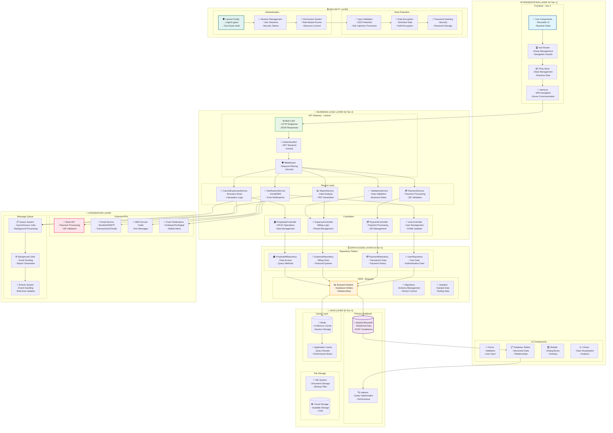

# 🏗️ Diagrama de Componentes - Arquitectura N-Tiers

Esta sección contiene el diagrama de componentes arquitectónico del sistema Expensas 365Soft, mostrando la estructura en capas N-Tiers con enfoque orientado a objetos.

---

## 🏢 1. Diagrama de Componentes General - Arquitectura N-Tiers

---

## 📊 Arquitectura N-Tiers - Descripción Detallada

### **🌐 Tier 1: Presentation Layer (Capa de Presentación)**
Responsable de la interacción con el usuario final y la visualización de datos.

#### **Frontend - Vue 3:**
- **Vue Components**: Componentes reutilizables y modulares
- **Vue Router**: Gestión de navegación y rutas
- **Pinia Store**: Manejo de estado reactivo
- **Inertia.js**: Navegación tipo SPA con refresh del servidor

#### **UI Components:**
- **Forms**: Formularios con validación integrada
- **Tables**: Tablas con ordenamiento y filtrado
- **Modals**: Diálogos y ventanas modales
- **Charts**: Visualización de datos y gráficos

---

### **🔌 Tier 2: Business Logic Layer (Capa de Lógica de Negocio)**
Contiene toda la lógica del negocio y reglas de la aplicación.

#### **API Gateway - Laravel:**
- **REST API**: Endpoints HTTP con respuestas JSON
- **Authentication**: Sesiones JWT y OAuth2
- **Middleware**: Filtrado de peticiones y seguridad

#### **Service Layer:**
- **CalculoExpensasService**: Cálculos y reglas de negocio para expensas
- **PaymentService**: Procesamiento de pagos y validación QR
- **NotificationService**: Sistema de notificaciones multi-canal
- **ValidationService**: Validación de datos y reglas de negocio
- **ReportService**: Generación de reportes y análisis

#### **Controllers:**
- **PropiedadController**: Gestión CRUD de propiedades
- **ExpensaController**: Lógica de facturación y períodos
- **PaymentController**: Procesamiento de pagos QR
- **UserController**: Gestión de usuarios y perfiles

---

### **🗄️ Tier 3: Data Access Layer (Capa de Acceso a Datos)**
Intermediario entre la lógica de negocio y la base de datos.

#### **ORM - Eloquent:**
- **Models**: Entidades de base de datos con relaciones
- **Migrations**: Control de versiones del esquema
- **Seeders**: Datos de ejemplo y prueba

#### **Repository Pattern:**
- **PropiedadRepository**: Acceso a datos de propiedades
- **ExpensaRepository**: Acceso a datos financieros
- **PaymentRepository**: Historial de transacciones
- **UserRepository**: Datos de autenticación y usuarios

---

### **💾 Tier 4: Data Layer (Capa de Datos)**
Almacenamiento persistente de datos del sistema.

#### **Primary Database:**
- **MySQL/MariaDB**: Base de datos relacional principal
- **Tables**: Estructura de datos organizada
- **Indexes**: Optimización de consultas

#### **Cache Layer:**
- **Redis**: Caché en memoria para rendimiento
- **Application Cache**: Resultados de consultas cacheados

#### **File Storage:**
- **File System**: Almacenamiento local de documentos
- **Cloud Storage**: Almacenamiento escalable y CDN

---

### **🔗 Integration Layer (Capa de Integración)**
Comunicación con sistemas externos y servicios terceros.

#### **External APIs:**
- **Bank API**: Procesamiento de pagos bancarios
- **Email Service**: Envío de correos transaccionales
- **SMS Service**: Mensajes de texto
- **Push Notifications**: Notificaciones móviles

#### **Message Queue:**
- **Queue System**: Procesamiento asíncrono
- **Background Jobs**: Tareas en segundo plano
- **Events System**: Manejo de eventos en tiempo real

---

### **🔒 Security Layer (Capa de Seguridad)**
Protección y control de acceso al sistema.

#### **Authentication:**
- **Laravel Fortify**: Sistema de autenticación robusto
- **Session Management**: Gestión de sesiones seguras
- **Permission System**: Control de acceso basado en roles

#### **Data Protection:**
- **Data Encryption**: Cifrado de datos sensibles
- **Password Hashing**: Almacenamiento seguro de contraseñas
- **Input Validation**: Protección contra ataques

---

## 🎯 Características de la Arquitectura

### **🏗️ Principios de Diseño:**
- **Separation of Concerns**: Cada capa tiene responsabilidades claras
- **Loose Coupling**: Mínima dependencia entre componentes
- **High Cohesion**: Funcionalidades relacionadas agrupadas
- **Scalability**: Capacidad de escalamiento horizontal y vertical
- **Maintainability**: Código fácil de mantener y modificar

### **🔧 Patrones Implementados:**
- **N-Tier Architecture**: Separación clara en capas
- **Repository Pattern**: Abstracción del acceso a datos
- **Service Layer**: Lógica de negocio centralizada
- **MVC Pattern**: Separación Modelo-Vista-Controlador
- **Observer Pattern**: Sistema de eventos y notificaciones
- **Factory Pattern**: Creación controlada de objetos

### **📊 Beneficios:**
- **Modularidad**: Componentes independientes y reutilizables
- **Testability**: Fácil prueba unitaria de cada capa
- **Flexibility**: Cambios en una capa no afectan a otras
- **Performance**: Optimización específica por capa
- **Security**: Múltiples capas de seguridad

---
*Diagrama de Componentes - Arquitectura N-Tiers*
*Actualizado: 21/11/2025*