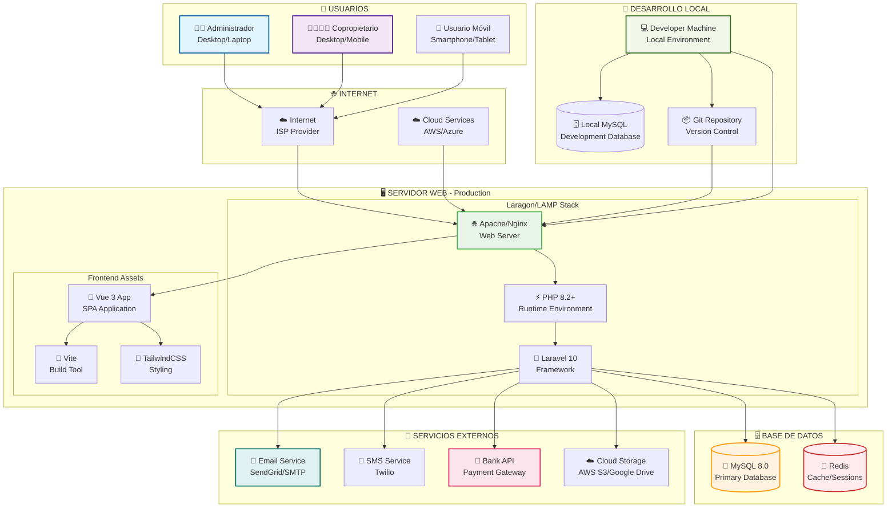
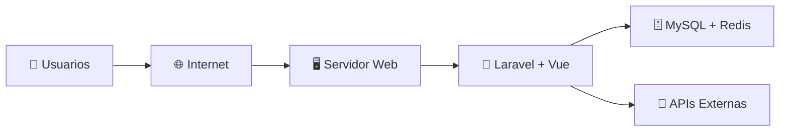

# 🖥️ Diagrama de Despliegue Físico - Expensas 365Soft

Esta sección contiene el diagrama de despliegue físico del sistema Expensas 365Soft, mostrando la infraestructura y distribución de componentes.

---

## 🏢 1. Diagrama de Despliegue - Arquitectura Física



---

## 📊 Descripción del Despliegue Físico

### **👥 Usuarios (Client Side)**
- **Administrador**: Acceso desde desktop/laptop para gestión completa
- **Copropietario**: Acceso desde desktop o mobile para consultas y pagos
- **Usuario Móvil**: Acceso optimizado para smartphones y tablets

### **🌐 Conectividad**
- **Internet**: Conexión a través de ISP estándar
- **Cloud Services**: Servicios en la nube para escalabilidad

### **🖥️ Servidor Web (Production)**
- **Laragon Stack**: Entorno de desarrollo en producción
- **Apache/Nginx**: Servidor web HTTP
- **PHP 8.2+**: Runtime de ejecución
- **Laravel 10**: Framework principal
- **Vue 3**: Aplicación frontend SPA
- **Vite**: Build tool para frontend

### **🗄️ Base de Datos**
- **MySQL 8.0**: Base de datos relacional principal
- **Redis**: Caché y sesiones en memoria

### **📧 Servicios Externos**
- **Email Service**: SendGrid o SMTP local
- **SMS Service**: Twilio para notificaciones
- **Bank API**: Gateway de pagos bancarios
- **Cloud Storage**: AWS S3 o similar para archivos

### **🔧 Desarrollo Local**
- **Developer Machine**: Ambiente local de desarrollo
- **Local MySQL**: Base de datos de desarrollo
- **Git Repository**: Control de versiones

---

## 🏗️ Infraestructura Simplificada

### **📋 Requisitos Mínimos:**
- **CPU**: 2+ cores
- **RAM**: 4GB+
- **Storage**: 50GB+ SSD
- **OS**: Linux/Windows Server
- **Network**: 100Mbps+

### **🔧 Stack Tecnológico:**
- **Web Server**: Apache/Nginx
- **Runtime**: PHP 8.2+
- **Framework**: Laravel 10
- **Frontend**: Vue 3 + Vite
- **Database**: MySQL 8.0 + Redis
- **Cache**: Redis
- **Queue**: Redis/Database

### **🌐 Accesibilidad:**
- **HTTPS**: Certificado SSL/TLS
- **Domain**: expensas365soft.com
- **CDN**: Opcional para assets estáticos
- **Backup**: Daily automatic backups

---

## 🚀 Despliegue Simplificado

### **📦 Flujo de Despliegue:**
1. **Development**: Código en máquina local
2. **Git Push**: Subida a repositorio
3. **Deploy**: Pull en servidor de producción
4. **Build**: Compilación de assets con Vite
5. **Migrate**: Ejecución de migraciones
6. **Cache Clear**: Limpieza de caché
7. **Go Live**: Sistema en producción

### **🔧 Comandos de Despliegue:**
```bash
# 1. Pull latest code
git pull origin main

# 2. Install dependencies
composer install --no-dev --optimize-autoloader
npm install && npm run build

# 3. Run migrations
php artisan migrate --force

# 4. Clear cache
php artisan cache:clear
php artisan config:clear
php artisan route:clear
php artisan view:clear
```

---

## 📊 Diagrama Simple - Vista Resumida



---
*Diagrama de Despliegue Físico - Expensas 365Soft*
*Actualizado: 21/11/2025*