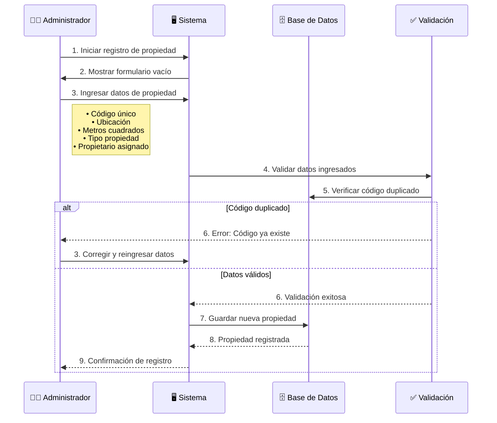
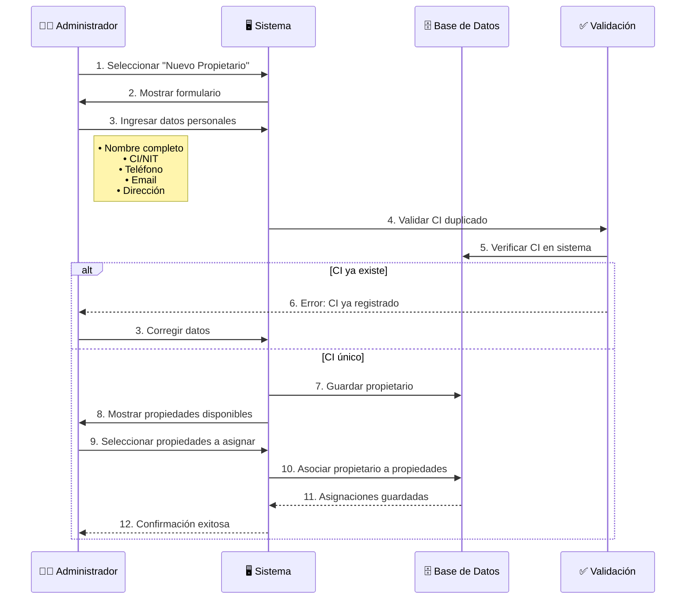
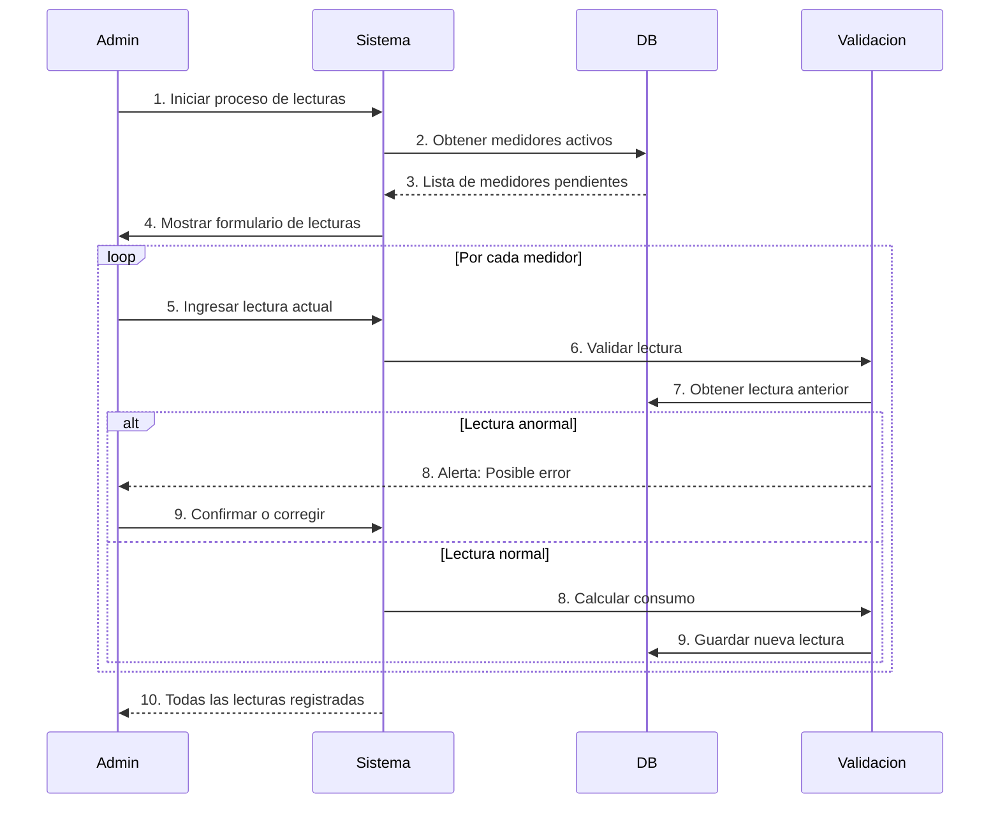
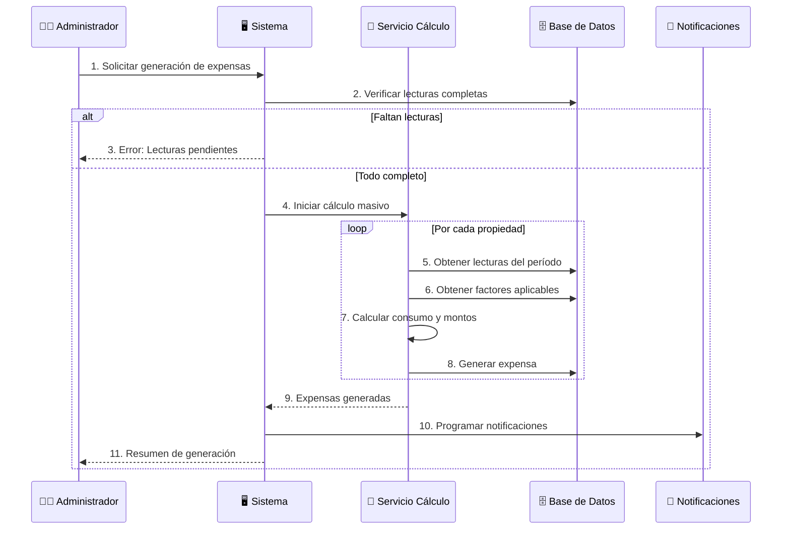
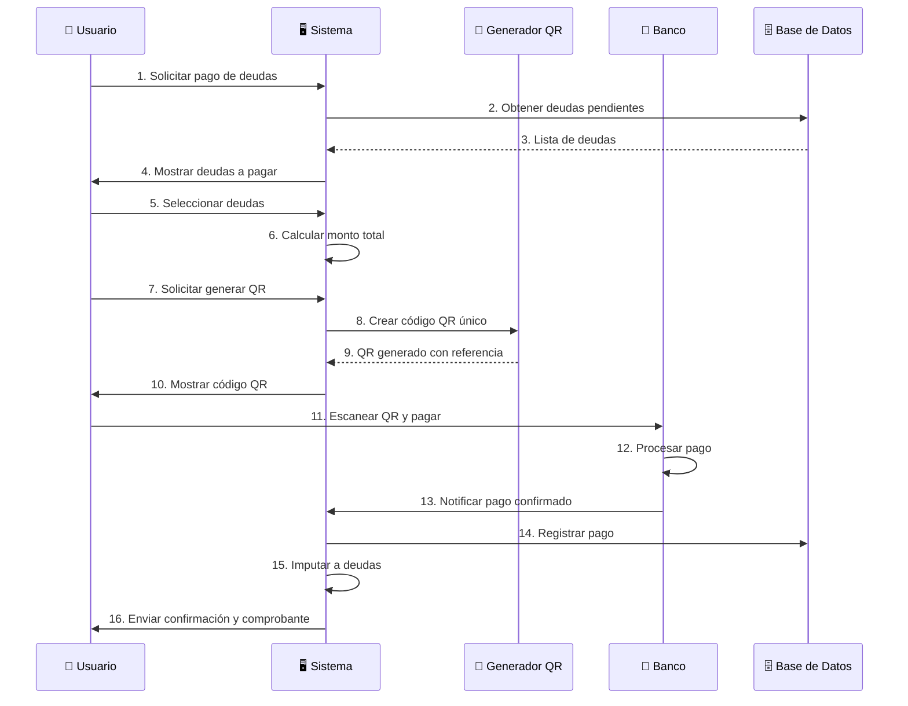
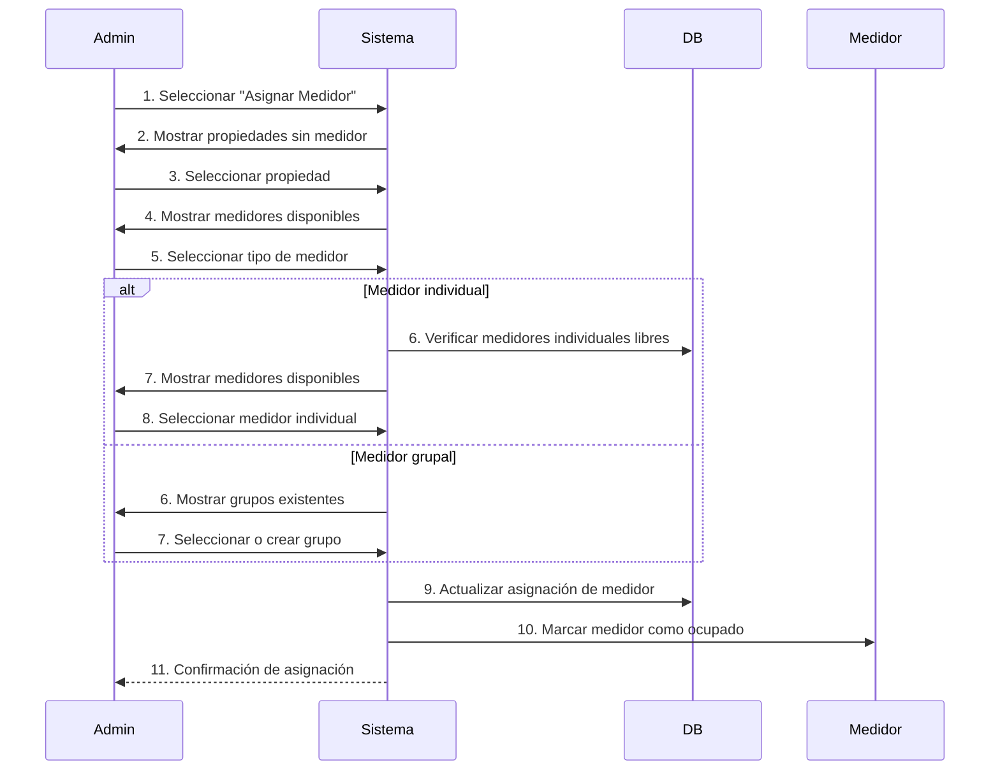
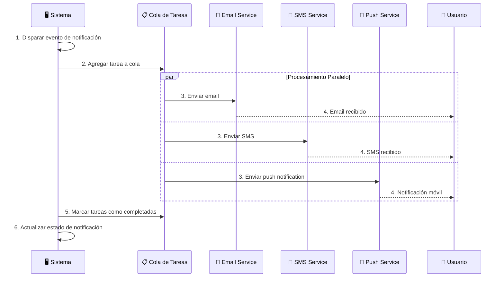
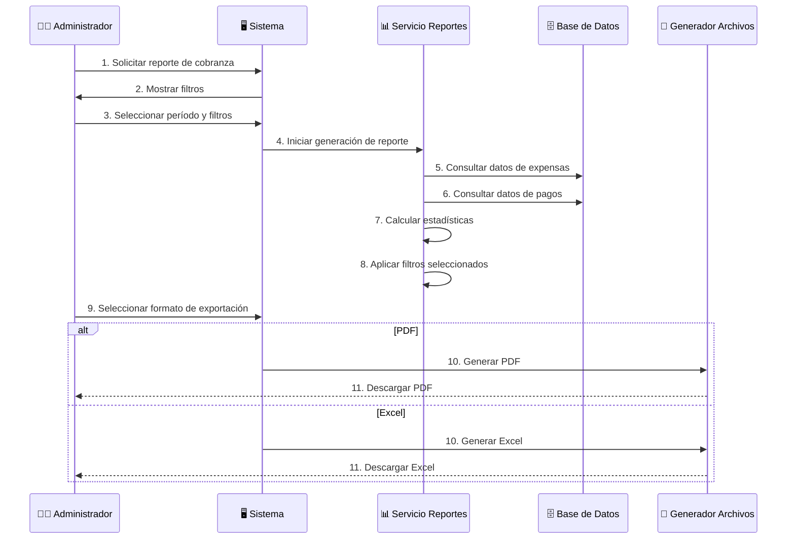
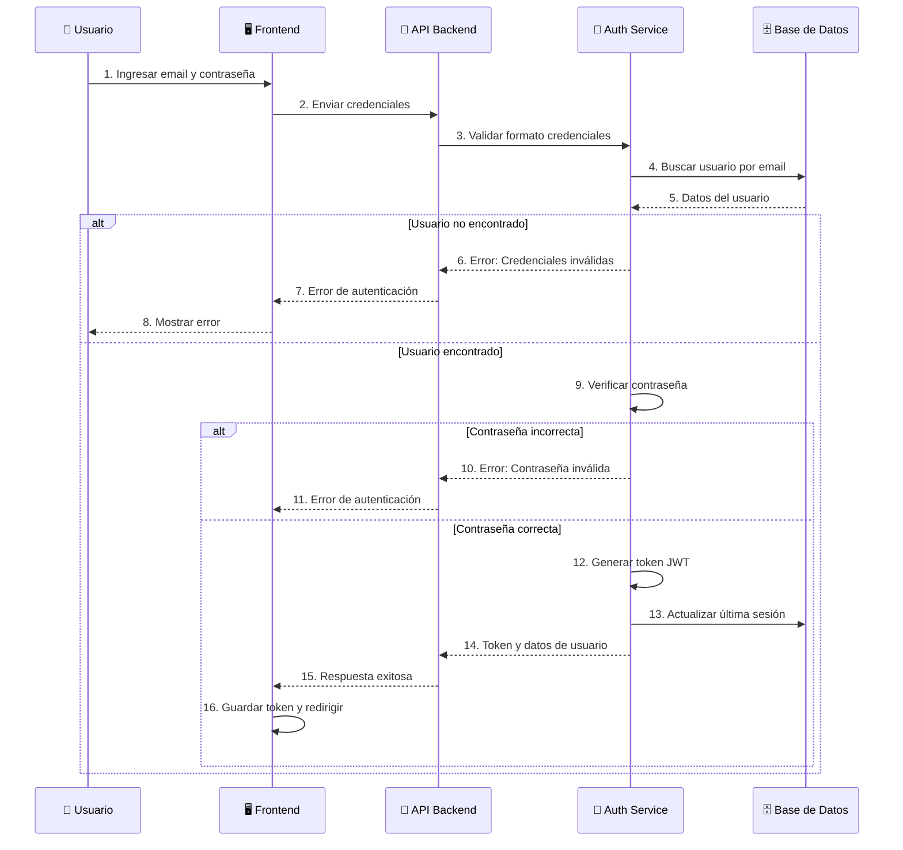
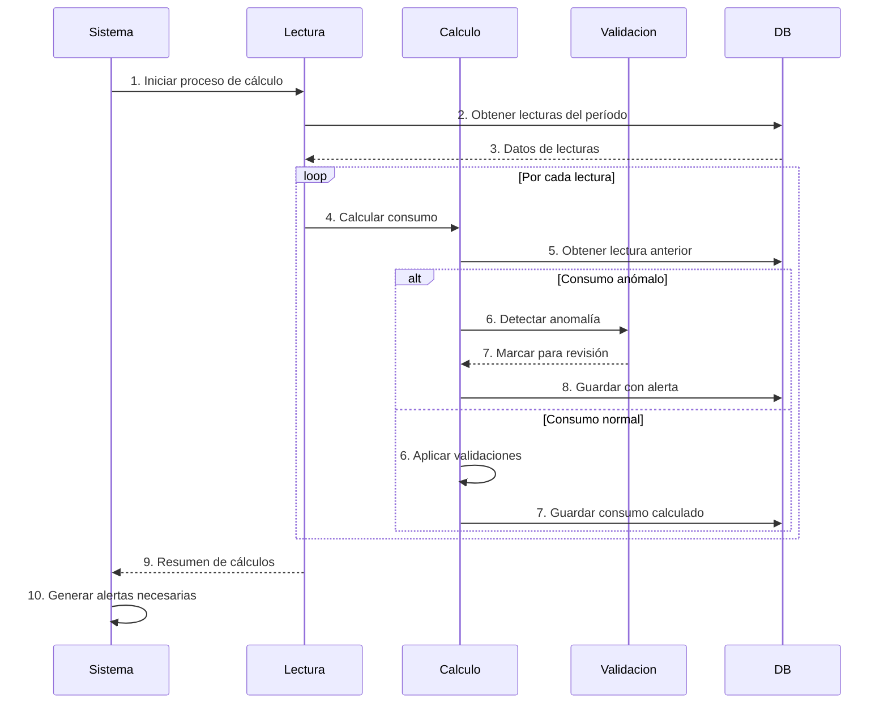

# 🔄 Diagramas de Procesos - Expensas 365Soft

Esta sección contiene los diagramas secuenciales de todos los procesos principales del sistema Expensas 365Soft, mostrando el flujo paso a paso de cada operación.

## 📋 Índice de Procesos

1. **Registro de Nueva Propiedad** - Proceso de alta de inmuebles
2. **Gestión de Propietarios** - Registro y asignación de propietarios
3. **Registro de Lecturas de Medidores** - Captura mensual de consumo
4. **Generación de Expensas** - Cálculo y facturación mensual
5. **Procesamiento de Pagos QR** - Flujo completo de pagos
6. **Asignación de Medidores** - Proceso de instalación/configuración
7. **Envío de Notificaciones** - Sistema de comunicaciones
8. **Generación de Reportes** - Análisis y exportación de datos
9. **Autenticación de Usuarios** - Login y seguridad
10. **Cálculo de Consumos** - Procesamiento de datos de medición

---

## 🏠 1. Proceso: Registro de Nueva Propiedad

---

## 👥 2. Proceso: Gestión de Propietarios

---

## 💧 3. Proceso: Registro de Lecturas de Medidores

---

## 🧾 4. Proceso: Generación de Expensas

---

## 💳 5. Proceso: Procesamiento de Pagos QR

---

## 🔧 6. Proceso: Asignación de Medidores

---

## 📧 7. Proceso: Envío de Notificaciones

---

## 📊 8. Proceso: Generación de Reportes

---

## 🔐 9. Proceso: Autenticación de Usuarios

---

## 📈 10. Proceso: Cálculo de Consumos

---

## 📋 Resumen de Procesos

| Proceso | Actores Principales | Complejidad | Frecuencia | Crítico |
|---------|-------------------|-------------|------------|---------|
| Registro Propiedad | Administrador | Media | Baja | No |
| Gestión Propietarios | Administrador | Media | Media | Sí |
| Registro Lecturas | Administrador | Alta | Mensual | Sí |
| Generación Expensas | Administrador | Alta | Mensual | Crítico |
| Procesamiento Pagos QR | Usuario | Alta | Variable | Crítico |
| Asignación Medidores | Administrador | Media | Baja | Sí |
| Envío Notificaciones | Sistema | Media | Variable | No |
| Generación Reportes | Administrador | Media | Mensual | No |
| Autenticación Usuarios | Usuario | Baja | Variable | Crítico |
| Cálculo Consumos | Sistema | Alta | Mensual | Sí |

---
*Diagramas de Procesos - Expensas 365Soft*
*Actualizado: 21/11/2025*